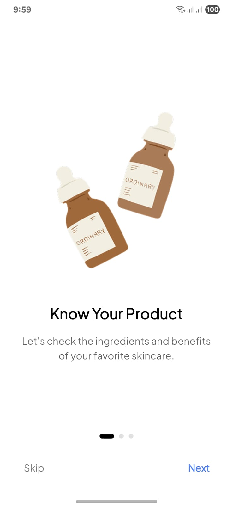
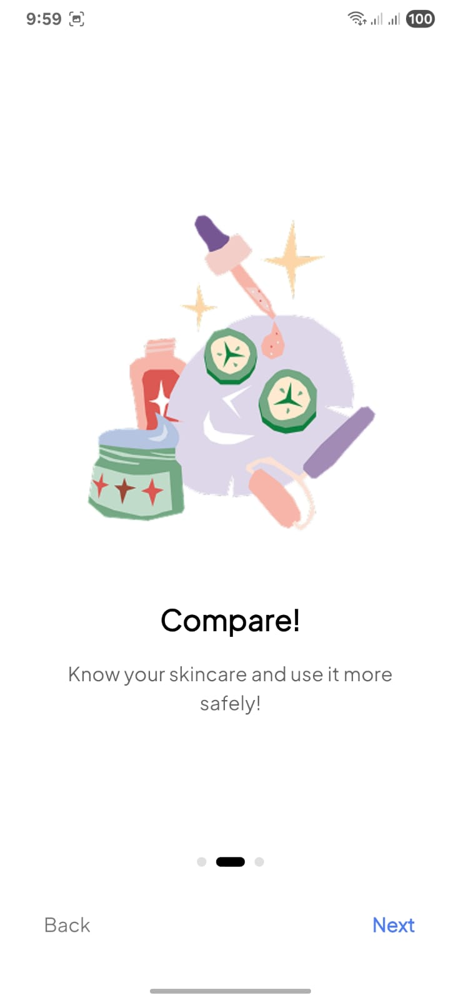
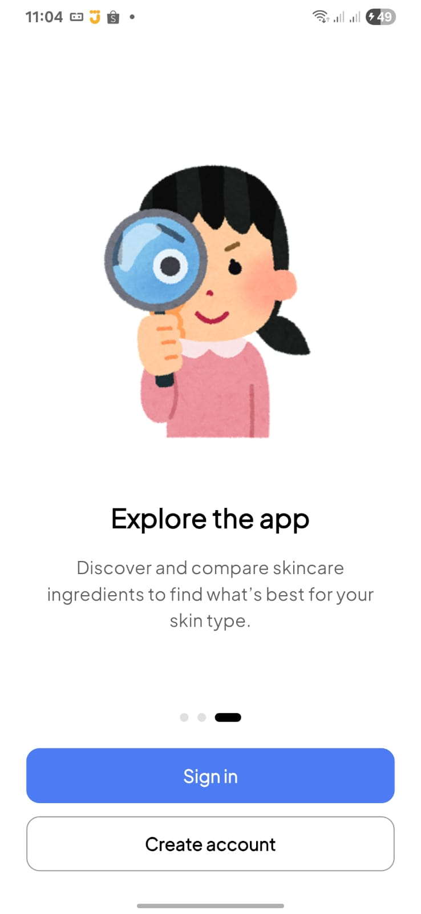
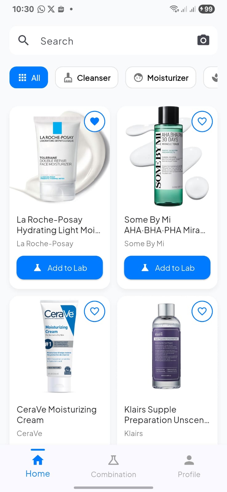
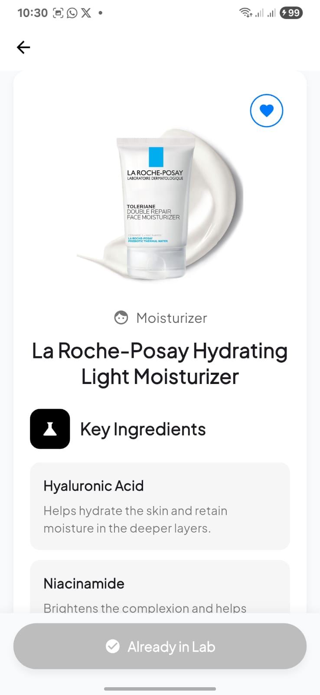
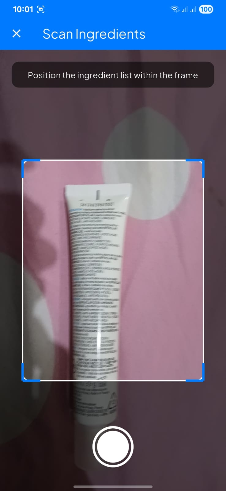
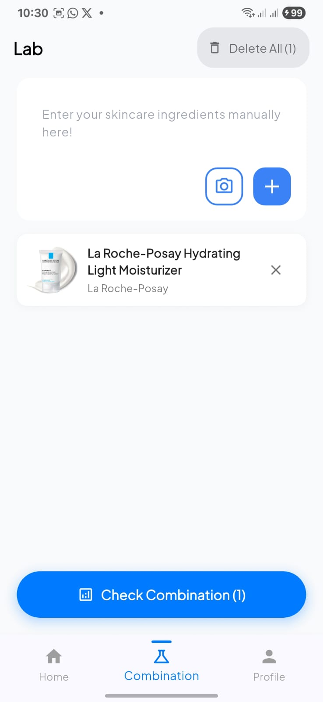

# MatchLab - Skincare Product Analysis App

A Flutter application for analyzing skincare product ingredients and checking compatibility between products.

## Features

- 🔍 **Product Search**: Search skincare products by name or brand
- 📸 **OCR Camera**: Scan product ingredients using camera
- 🧪 **Lab Analysis**: Add products to lab and check ingredient combinations
- ❤️ **Wishlist**: Save favorite products for later
- 📊 **Product Categories**: Browse products by categories (All, Serum, Toner, Moisturizer, etc.)
- 📱 **User Profile**: Manage user account and preferences

## Tech Stack

- **Framework**: Flutter
- **State Management**: Provider
- **Navigation**: Named Routes
- **UI Components**: Custom widgets with Material Design

## Project Structure

```
lib/
├── data/
│   ├── api/                    # API services
│   ├── model/                  # Data models
│   ├── category_data.dart      # Category definitions
│   └── product_data.dart       # Product database
│
├── provider/
│   ├── camera_ocr_provider.dart    # OCR camera state management
│   ├── home_provider.dart          # Home screen state
│   ├── ingredients_provider.dart   # Lab/ingredients state
│   ├── user_provider.dart          # User authentication state
│   └── wishlist_provider.dart      # Wishlist state
│
├── static/                     # Static assets
│
├── style/
│   └── skincare_text_style.dart    # Text styles theme
│
├── ui/
│   ├── camera/                 # Camera OCR screens
│   ├── combination_page/       # Ingredient combination checker
│   ├── detail_product/         # Product detail screens
│   ├── home/                   # Home screen and widgets
│   ├── login_regist/           # Authentication screens
│   ├── onboarding/             # Onboarding screens
│   ├── profile/                # Profile screens
│   ├── splash/                 # Splash screen
│   └── bottom_navbar.dart      # Bottom navigation bar
│
└── main.dart                   # App entry point
```

## Getting Started

### Prerequisites

- Flutter SDK (>=3.0.0)
- Dart SDK (>=3.0.0)
- Android Studio / VS Code
- Android Emulator / iOS Simulator / Physical Device

### Installation

1. Clone the repository
```bash
git clone https://github.com/nadyanjln/Skincare-Compatibility-Checker.git capstone
cd capstone
```

2. Install dependencies
```bash
flutter pub get
```

3. Run the app
```bash
flutter run
```

## Screenshots

<div align="center">
  
  
  
  
</div>

<div align="center">
  
  
  
  
</div>

## Dependencies

```yaml
dependencies:
  flutter:
    sdk: flutter
  
  # State Management
  provider: ^6.1.1
  
  # UI Components
  cupertino_icons: ^1.0.2
  
  # HTTP & API
  http: ^1.1.0
  
  # Image Processing & OCR
  image_picker: ^1.0.4
  camera: ^0.10.5+5
  google_mlkit_text_recognition: ^0.11.0
  
  # Local Storage
  shared_preferences: ^2.2.2
  
  # Navigation
  provider: ^6.1.5+1
  
  # Utils
  intl: ^0.18.1

dev_dependencies:
  flutter_test:
    sdk: flutter
  flutter_lints: ^3.0.0
```

### Key Dependencies Explained

- **provider**: State management solution
- **camera**: Access device camera for OCR
- **google_mlkit_text_recognition**: Extract text from images
- **image_picker**: Pick images from gallery
- **shared_preferences**: Store user preferences locally
- **http/dio**: HTTP client for API requests
- **go_router**: Advanced navigation management

## Features in Detail

### 🏠 Home Screen
- Real-time product search
- Category filtering
- Add to Lab functionality
- Wishlist toggle
- Product detail navigation

### 📸 Camera OCR
- Scan product ingredient labels
- Extract text from images
- Auto-detect ingredients

### 🧪 Combination Page
- Analyze multiple products together
- Check ingredient compatibility
- View ingredient interactions

### 📦 Product Detail
- Detailed product information
- Ingredient list
- Product reviews and ratings

### 👤 Profile
- User information
- App settings
- Saved preferences
- Account management

### 🚀 Onboarding
- Welcome screens
- App feature introduction
- Getting started guide

## Development

### Adding New Products

Edit `lib/data/product_data.dart`:

```dart
{
  'name': 'Product Name',
  'brand': 'Brand Name',
  'category': 'Serum',
  'image': 'assets/images/product.jpg',
  'ingredients': ['Ingredient 1', 'Ingredient 2'],
}
```

### Adding New Categories

Edit `lib/data/category_data.dart`:

```dart
{
  'icon': Icons.category_icon,
  'label': 'Category Name',
}
```

### Creating New Providers

1. Create a new file in `lib/provider/`
2. Extend `ChangeNotifier`
3. Add to `main.dart` MultiProvider

```dart
class MyProvider extends ChangeNotifier {
  // Your state here
  
  void updateState() {
    notifyListeners();
  }
}
```

## Navigation Routes

- `/` - Splash Screen
- `/onboarding` - Onboarding
- `/login` - Login & Registration
- `/home` - Home Screen
- `/product_detail` - Product Detail
- `/cek_kombinasi` - Combination Checker
- `/camera_ocr` - Camera OCR
- `/profile` - User Profile

## Contributing

1. Fork the project
2. Create your feature branch (`git checkout -b feature/AmazingFeature`)
3. Commit your changes (`git commit -m 'Add some AmazingFeature'`)
4. Push to the branch (`git push origin feature/AmazingFeature`)
5. Open a Pull Request

## Resources

- [Flutter Documentation](https://docs.flutter.dev/)
- [Provider Package](https://pub.dev/packages/provider)
- [Flutter Cookbook](https://docs.flutter.dev/cookbook)
